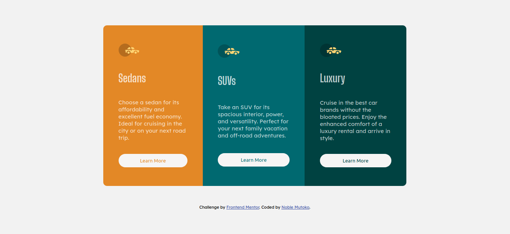

# Frontend Mentor - 3-column preview card component solution

This is a solution to the [3-column preview card component challenge on Frontend Mentor](https://www.frontendmentor.io/challenges/3column-preview-card-component-pH92eAR2-). Frontend Mentor challenges help you improve your coding skills by building realistic projects. 

## Table of contents

- [Overview](#overview)
  - [The challenge](#the-challenge)
  - [Screenshot](#screenshot)
  - [Links](#links)
- [My process](#my-process)
  - [Built with](#built-with)
  - [What I learned](#what-i-learned)
  - [Continued development](#continued-development)
  - [Useful resources](#useful-resources)
- [Author](#author)

## Overview

### The challenge

Users should be able to:

- View the optimal layout depending on their device's screen size
- See hover states for interactive elements

### Screenshot

### Links

- Live Site URL: [Check out the [Live Site]](https://codeplayer12.github.io/column-preview-card/)

## My process

### Built with

- Semantic HTML5 markup
- CSS custom properties
- Flexbox

### What I learned

Reinforced good practice  with HTML5 markup and custom css properties.

### Continued development

Implementing different types of CSS libraries with the same project i.e Tailwind,Less,Sass.

### Useful resources

- [resource 1](https://www.w3schools.com/css/css3_mediaqueries_ex.asp) - W3schools media queries very helpful in understanding mobile support.

## Author

- Frontend Mentor - [@codeplayer12](https://www.frontendmentor.io/profile/codeplayer12)
- Twitter - [@noblethunder](https://www.twitter.com/noblethunder)

